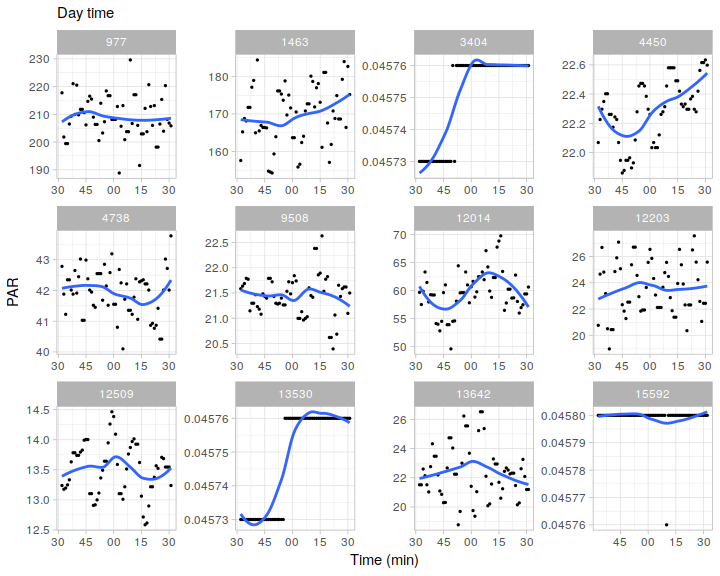
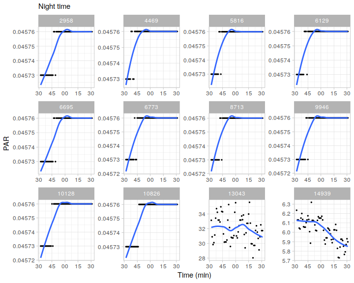
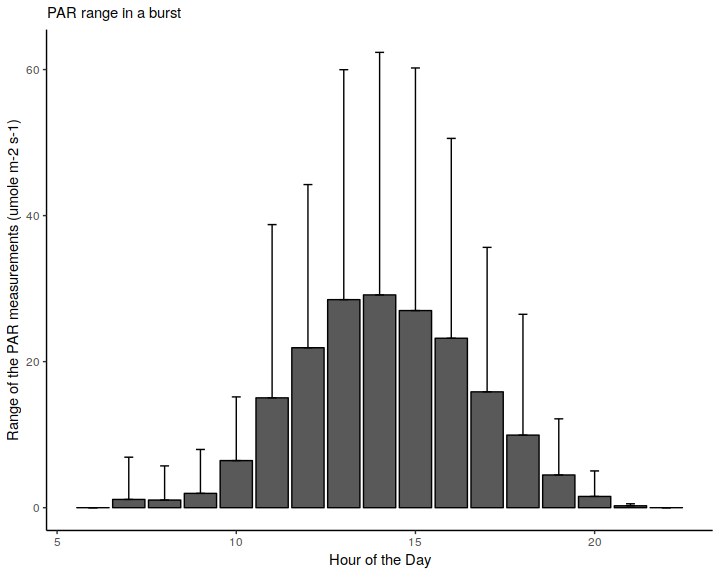
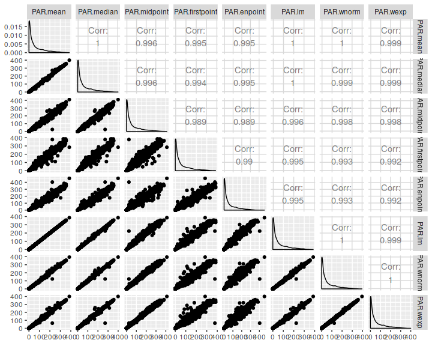
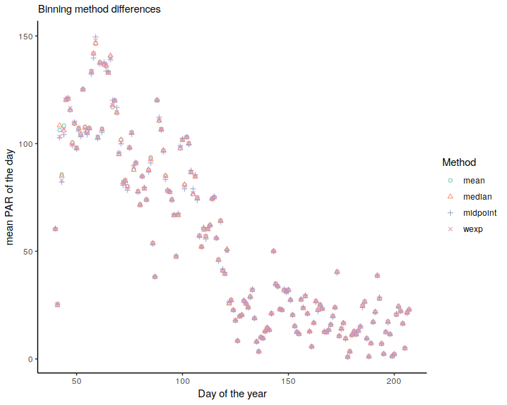

Check binning methods for PAR
================
E. Klein
201-09-03

Last run 2019-09-05 09:43:35

## Goal

To test different methods to bin PAR bursts into one measure per burst.
The methods explored are:

  - mean
  - median
  - linear interpolation at the mid timestamp
  - the first/middle/last value of the burst
  - weighted average using normal and exponential weights

Read Data

``` r
## read one ncdf file with PAR and make a DF
nc = nc_open("IMOS_ANMN-QLD_CFKOSTUZ_20140209T012944Z_PIL050_FV01_PIL050-1402-WQM-29.5_END-20140727T182950Z_C-20170620T014959Z.nc")
latitude = ncatt_get(nc,varid=0, attname="geospatial_lat_max")$value
longitude = ncatt_get(nc,varid=0, attname="geospatial_lon_max")$value
latlon = matrix(c(longitude, latitude), nrow = 1)

df = data.frame(TIME=ncvar_get(nc, "TIME"), PAR = ncvar_get(nc, "PAR"))
nc_close(nc)

## convert time and identify the bursts
df$dateTime = as.POSIXct(df$TIME*60*60*24, origin = "1950-01-01 00:00:00")
df$timeHour = hour(df$dateTime)
df$timediff = c(1, diff(df$dateTime))
df$burst = ifelse(df$timediff>5,1,0)
df$burstseq = cumsum(df$burst)

## remove the first 10 bursts, normally they are ill formed
df = subset(df, burstseq>=5)

## create day/nigh variable
df$DN = isDay(latlon, df$dateTime)
```

Some random burst patterns

Day Time:

``` r
nplots = 12
burstsample = sample(unique(df$burstseq[df$DN==1]), nplots)

df.sample = subset(df, burstseq %in% burstsample)

pp = ggplot(df.sample, aes(dateTime, PAR))
pp + geom_point(size = 0.5) + geom_smooth(se=F) + 
  labs(x="Time (min)", y="PAR", subtitle = "Day time") + 
  theme_light() + 
  facet_wrap(facets = "burstseq", scales = "free")
```



Night Time

``` r
nplots = 12
burstsample = sample(unique(df$burstseq[df$DN==0]), nplots)

df.sample = subset(df, burstseq %in% burstsample)

pp = ggplot(df.sample, aes(dateTime, PAR))
pp + geom_point(size = 0.5) + geom_smooth(se=F) + 
  labs(x="Time (min)", y="PAR", subtitle = "Night time") + 
  theme_light() + 
  facet_wrap(facets = "burstseq", scales = "free")
```



The variability in the reading during the night time is very small and
possibly not important in terms of its magnitude. Much more variable are
day time measurements. So the next sections are related only to DAYTIME
measurements.

Some stats:

It is interesting to look at the variability of the estimates,
considering that all have been produced using the same data. In
principle we expect more variability in daytime measurements

``` r
## weights for n=60
ww.norm = weights.norm(60)
ww.exp = weights.exp(60)


df.bursts = df %>% filter(DN==1) %>% group_by(timeHour, burstseq) %>% filter(n()==60) %>% 
  summarise(n = n(), PAR.sd = sd(PAR), PAR.range = max(PAR)-min(PAR), 
            PAR.mean = mean(PAR), PAR.median = median(PAR), 
            PAR.midpoint = PAR[round(n()/2)], PAR.firstpoint = PAR[1], PAR.enpoint = PAR[n()],
            PAR.lm = predict(lm(PAR~dateTime), data.frame(dateTime=mean(dateTime))), 
            PAR.wnorm = weighted.mean(PAR, ww.norm),
            PAR.wexp =  weighted.mean(PAR, ww.exp),
            TIME.mean = mean(dateTime)) 

df.burstsLong = melt(df.bursts, id.vars = 1:2, measure.vars = 4:13, variable.name = "PARmethod", value.name = "PARvalue")
burstsStats = df.burstsLong %>% group_by(timeHour, PARmethod) %>% 
  summarise(PAR.mean = mean(PARvalue), PAR.sd = sd(PARvalue), PAR.range = max(PARvalue) - min(PARvalue))
```

First some description about the variability of the PAR measurements in
a burst in the different day
hours.

``` r
pp = ggplot(subset(burstsStats, PARmethod=="PAR.range"), aes(timeHour, PAR.mean, group=timeHour))
pp + geom_bar(stat = "identity", colour="black") + 
  geom_errorbar(aes(ymin = PAR.mean, ymax = PAR.mean+PAR.sd), width = 0.25) + 
  labs(x="Hour of the Day", y="Range of the PAR measurements (umole m-2 s-1)", subtitle = "PAR range in a burst") + 
  theme_classic()
```



``` r
pp = ggplot(subset(burstsStats, PARmethod=="PAR.sd"), aes(timeHour, PAR.mean, group=timeHour))
pp + geom_bar(stat = "identity", colour="black") + 
  geom_errorbar(aes(ymin = PAR.mean, ymax = PAR.mean+PAR.sd), width = 0.25) + 
  labs(x="Hour of the Day", y="PAR standard deviation (umole m-2 s-1)", subtitle = "PAR standard deviation in a burst") + 
  theme_classic()
```


## plot pairs

``` r
ggpairs(df.bursts[,6:13])
```



The largest variability in the binned PAR estimate is produced by the
use of the start/mid/end point of the burst, as expected. The median,
linear interpolation and the normal weight averaging produced the
highest correlation values with the mean estimate.

For a full day (day time only) the mean estimates of PAR with different
binning method (mean, median, midpoint and exponential weighted avg)
showed very little variations, more associated with the use of midpoint.

``` r
df.bursts.day = df.bursts %>% group_by(yDay = yday(TIME.mean)) %>% 
  summarise(PARdaymean.mean = mean(PAR.mean), 
            PARdaymean.sd = sd(PAR.mean, na.rm = T),  
            PARdaymedian.mean = mean(PAR.median), 
            PARdaymedian.sd = sd(PAR.median, na.rm = T), 
            PARdaymidpoint.mean = mean(PAR.midpoint), 
            PARdaymidpoint.sd = sd(PAR.midpoint, na.rm = T), 
            PARdaywexp.mean = mean(PAR.wexp), 
            PARdaywexp.sd = sd(PAR.wexp, na.rm = T), )

df.bursts.day.long = melt(df.bursts.day, id.vars = 1, measure.vars = c(2,4,6,8), value.name = "PARmean", variable.name = "Method")
            
pp = ggplot(df.bursts.day.long, aes(yDay, PARmean, shape=Method, colour=Method))
pp + geom_point() + 
  labs(x="Day of the year", y = "mean PAR of the day", subtitle = "Binning method differences") + 
  theme_classic() + 
  scale_color_manual(labels=c("mean", "median", "midpoint", "wexp"), values=c(1,2,3,4), aesthetics = c("shape", "colour"))
```



## Conclusion

  - The most variable estimate for a single burst value is produced with
    the use of a single point estimate, being the first point, the
    midpoint or the last point of the burst.

  - No important differences obtained when comparing estimates using
    mean, median, linear interpolation, normal or exponential weighted
    average

## Recommendation

  - the use of any single value as a representative measure of a burst
    implies a high variability, so it use is not recommended

  - As the median can filter out extreme outliers that can influence the
    mean estimate, and as the median is also an accepted CF cell method,
    this is the recommended method for binning the PAR burst.
